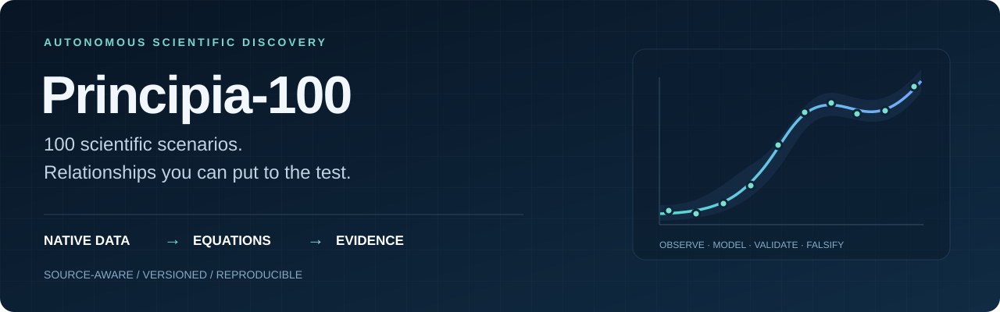

<p align="center">
  
</p>

<h1 align="center">Principia ASD Benchmark</h1>
<p align="center"><strong>100 scientific scenarios for discovering relationships that can be tested.</strong></p>
<p align="center">
  <a href="CATALOG.md"></a>
  <a href="DATASET_CARD.md"></a>
  <a href="EVALUATION_PROTOCOL.md"></a>
  <a href="LICENSES.md"></a>
</p>
<p align="center">
  <a href="CATALOG.md">Explore all 100</a> ·
  <a href="DOWNLOAD.md">Download</a> ·
  <a href="EVALUATION_PROTOCOL.md">Evaluation protocol</a> ·
  <a href="DATASET_CARD.md">Dataset card</a> ·
  <a href="#cite-and-reuse">Cite and reuse</a>
</p>

---

**Can an autonomous discovery system turn an unfamiliar research folder into a compact, testable quantitative relationship—and show exactly where that relationship holds?**

**Principia-100** makes that question concrete. It brings together 100 independently sourced scenarios spanning semiconductor devices, experimental physics, biology, medicine, environmental science, social science, computing and mathematics. Each case pairs source-native data with context, a neutral research brief, traceable provenance and a case-specific validation design.

The collection is a core part of [Principia](../README.md), and can also support other discovery systems or human-led studies. It is an **open, source-aware research corpus and evaluation protocol**. Source publications and prior fitted results are disclosed; the benchmark does not supply hidden gold discoveries or an aggregate discovery score.

## At a glance

| Property | Release v0.1.0 |
| :--- | :--- |
| **Scope** | 100 scenarios, stable IDs `P100-001`–`P100-100`, with 100 task cards |
| **Data origins** | 85 measured/observed cases, 8 mixed measured/computational cases, 6 computational experiments, 1 mathematical reference corpus |
| **Scientific assets** | 1,685 frozen files with SHA-256, byte size, source version and attribution records |
| **Download size** | About **4.80 GB** for the full benchmark; most individual cases are below 100 MB |
| **Per-case ceiling** | Every retained case is below 500 MB both stored and expanded; exact sizes are in the [catalog](CATALOG.md) |
| **Native formats** | Spreadsheets, text logs, scientific arrays, instrument signals, images, audio, video, spatial data and computational records |
| **Evaluation** | Executable relationships, uncertainty, appropriate held-out groups, falsifying controls and disclosed prior art |

“Source-native” means the bytes supplied by the publisher are preserved. Some publishers supply calibrated signals, extracted calls, count matrices, figure-source tables or computed results. Those processing stages are documented rather than relabeled as untouched instrument telemetry. Measurement dates are recorded separately from deposit dates.

## Explore the collection

The examples below illustrate the range of questions and validation units. They are research opportunities, not promised findings. Open a **task card** to inspect what the retained data can support.

| Research area | Representative cases | A quantitative question to investigate |
| :--- | :--- | :--- |
| **Devices & manufacturing** | [21 · Josephson junctions](task_cards/021.md) · [53 · Screw-driving friction](task_cards/053.md) | How do fabrication or operating conditions relate to electrical and mechanical response? |
| **Materials & chemistry** | [24 · Composite fatigue](task_cards/024.md) · [61 · Membrane permeation](task_cards/061.md) | Which response relationships remain valid across specimens, treatments or test conditions? |
| **Energy & robotics** | [52 · Wind-turbine control](task_cards/052.md) · [69 · Gearbox temperature](task_cards/069.md) | How do input history and operating conditions determine power or thermal response? |
| **Biotechnology & cell biology** | [71 · CHO cultivations](task_cards/071.md) · [75 · Endothelial mechanics](task_cards/075.md) | Which relationships transfer across complete cultivations or donors? |
| **Medicine & neuroscience** | [33 · Smartphone PPG](task_cards/033.md) · [78 · Multicenter assays](task_cards/078.md) | How do acquisition conditions and laboratory effects bound a measurement or assay? |
| **Earth, ocean & atmosphere** | [47 · Argo biogeochemistry](task_cards/047.md) · [94 · Arctic CTD](task_cards/094.md) | Which relationships persist across profiles, stations or environmental conditions? |
| **Society & behavior** | [39 · Adult skills and earnings](task_cards/039.md) · [89 · Context and risk](task_cards/089.md) | Which associations remain after accounting for survey design, repeated participants and context? |
| **Computing, mathematics & space** | [43 · AI training trajectories](task_cards/043.md) · [98 · Metric polytopes](task_cards/098.md) · [45 · Fermi gamma-ray burst](task_cards/045.md) | Can a scoped quantitative pattern survive held-out configurations, exact checking or independent event intervals? |

**[Browse the complete catalog →](CATALOG.md)** · [Machine-readable CSV](CATALOG.csv) · [JSON](CATALOG.json)

## Start with one case

A small starting point is [P100-061: membrane permeation](scenarios/61_chemistry_membrane_permeation/), with two native experimental workbooks and source context. The [download guide](DOWNLOAD.md) shows how to fetch just that case, add another case or obtain all 100. Large files use **Git LFS**; GitHub's ordinary “Download ZIP” is not a reliable substitute for the documented download procedure.

After downloading:

```bash
cd Principia/ASD-benchmarks
python3 tools/replay.py --root . --mode verify --case P100-061
```

Use Python 3.9 or newer. This verifies the retained source assets; it does not fit a model or evaluate a scientific claim.

To explore the case in Principia, start [Principia v1.4.2](../README.md#start-v142-locally), choose **New research → Add data**, connect the case folder and use `USER_BRIEF.txt` to describe the practical question. Configure your own model provider before starting a discovery run. Native-reader audit coverage and Principia ingestion support are separate: this release has not run every case through the application.

For a benchmark evaluation, construct the input directory from [INPUT_ALLOWLIST.json](INPUT_ALLOWLIST.json), which includes the neutral brief and approved source assets. Keep task cards, reviewer guidance and earlier outputs outside that directory. Freeze the actual validation groups and analysis budget before fitting.

## From a plausible statement to a scientific result

A submission should provide an **executable equation**, defined variables and units, parameter estimates and uncertainty, an applicability range, exact source anchors, and reproducible analysis code. It should compare against relevant baselines on the same held-out groups and show what could falsify the relationship.

| Outcome | What the evidence must establish |
| :--- | :--- |
| **Reproduction** | An existing published relationship was recovered, independently checked or falsified, with its prior availability disclosed. |
| **Validated extension** | A scoped relationship goes beyond the disclosed source result and is supported on appropriate held-out groups or conditions. |
| **Novelty candidate** | A validated extension also survives documented literature review and independent scientific adjudication. |
| **Justified abstention** | The data, identifiability, independent units or evidence do not support the proposed claim. Negative results remain part of the record. |

Validation follows the experiment: hold out donors, devices, laboratories, sites, cultivation pairs, complete runs or mathematical instances as appropriate. Repeated rows, pixels, cells and time samples are not automatically independent. Single-system cases carry explicit limits. The original 20 scenarios were used during Principia development, and published analyses may be visible in source archives or model training data.

Read the [evaluation protocol](EVALUATION_PROTOCOL.md) and use the [submission schema](schemas/SUBMISSION.schema.json). No universal discovery score, causal guarantee or industrial-readiness claim is attached to corpus acceptance.

## What ships with each case

```text
ASD-benchmarks/
├── scenarios/<scenario-id>/
│   ├── raw/                 # Source-native data and original archives
│   ├── context/             # Approved source context and provenance evidence
│   ├── USER_BRIEF.txt        # Neutral practical question
│   ├── SCENARIO.md           # Source, processing and interpretation notes
│   ├── PROVENANCE.json       # Asset provenance
│   └── SHA256SUMS            # Per-case integrity checks
├── task_cards/              # 100 scientific scope and validation cards
├── reports/                 # Native-format and acquisition evidence
├── schemas/                 # Benchmark manifest and submission contracts
└── tools/                   # Integrity checks, replay and native-reader audits
```

| Need | Read |
| :--- | :--- |
| Choose a case or inspect its scope | [Catalog](CATALOG.md) · [Dataset card](DATASET_CARD.md) |
| Download and verify files | [Download guide](DOWNLOAD.md) · [Tool instructions](TOOLS.md) |
| Run a defensible study | [Protocol](EVALUATION_PROTOCOL.md) · [Input allowlist](INPUT_ALLOWLIST.json) |
| Review a submission | [Reviewer guide](REVIEWER_GUIDE.md) · [Output schema](schemas/SUBMISSION.schema.json) |
| Trace an asset to its source | [Acquisition manifest](ACQUISITION_MANIFEST.json) · [Citations](CITATIONS.json) |
| Check reuse conditions | [License guide](LICENSES.md) · [Per-asset register](LICENSE_REGISTER.json) |
| Inspect verification and known limitations | [Validation report](VALIDATION_REPORT.md) · [Format coverage](FORMAT_COVERAGE.json) · [Publication checks](PUBLICATION_REPORT.json) |
| Reconstruct this release | [Release manifest](RELEASE_MANIFEST.json) · [Changelog](CHANGELOG.md) · [Substitutions](SUBSTITUTIONS.json) |

## Integrity and scope

The publication preserves all 1,685 accepted source assets byte for byte. Acquisition checks covered transport completeness, available publisher checksums, local hashes, archive integrity and paths, retained scientific structure, redistribution evidence and case-specific limitations. Tools include disposable corruption and replay tests. Exact reader coverage is reported: some vendor formats and opaque objects have bounded inspection rather than complete semantic decoding.

Some planned datasets were replaced because access or reuse requirements could not be met; those substitutions remain explicit. Original local folders were preserved. The legacy repository [`scenario/`](../scenario/) is historical; use this versioned `ASD-benchmarks/` collection for the 100-case corpus. No private reference dataset or private discovery output is included.

## Cite and reuse

Cite **Principia contributors (2026), _Principia-100: A Source-Aware Corpus for Quantitative Scientific Discovery_, v0.1.0**, link to this repository, and record the release tag or commit and the case IDs used. [CITATION.cff](CITATION.cff) supplies machine-readable corpus citation metadata. **Also cite the original dataset authors and versions** listed in [CITATIONS.json](CITATIONS.json).

Third-party data keep their **source-specific licenses and terms**. Curator-written documentation is [CC BY 4.0](https://creativecommons.org/licenses/by/4.0/); curator tooling is [MIT](tools/LICENSE). These do not override publisher licenses or embedded notices. Read [LICENSES.md](LICENSES.md) before redistribution or commercial reuse.

## Help make scientific discovery more testable

Useful contributions include a reproducible reader fix, a clearer unit or calibration reference, a documented source inconsistency, a falsifying result, or a new independently sourced experiment. See [CONTRIBUTING.md](CONTRIBUTING.md), and open a [GitHub issue](https://github.com/pzqpzq/Principia/issues) with the case ID and evidence. Preserve failures and source bytes; propose data changes as a new case revision.
