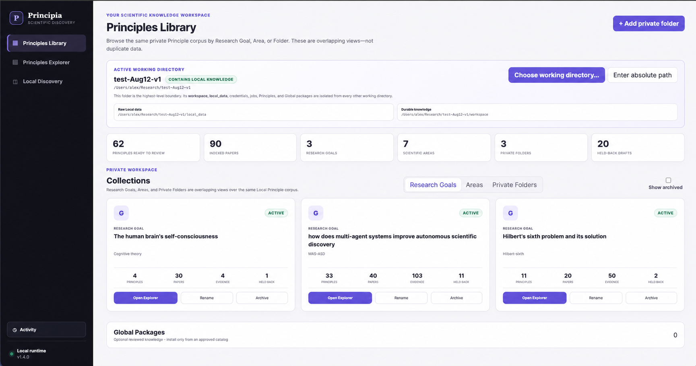
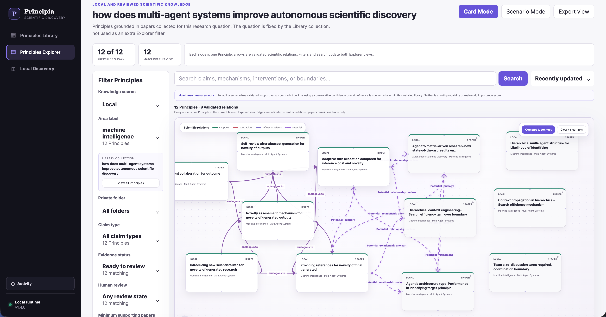
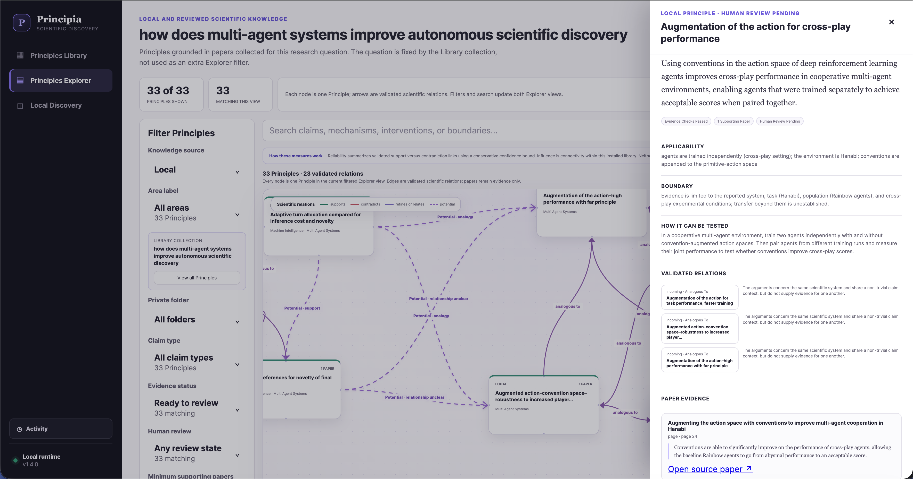

<h1 align="center">Principia</h1>

<p align="center"><strong>The living Principles Cloud for Autonomous Scientific Discovery</strong></p>
<p align="center"><em>From scientific works to reusable Principles. From Principles to solutions.</em></p>

<p align="center">
  <a href="https://github.com/pzqpzq/Principia/actions/workflows/ci.yml"></a>
  <a href="https://github.com/pzqpzq/Principia/tree/main/Principia-v1.4"></a>
  <a href="https://pypi.org/project/principia-ai/"></a>
  <a href="https://github.com/pzqpzq/Principia/tree/main/Principia-v1.4/core"></a>
  <a href="https://github.com/pzqpzq/Principia/blob/main/Principia-v1.4/core/LICENSE"></a>
  <a href="https://icml.cc/virtual/2026/poster/61557"></a>
</p>

<p align="center">
  <a href="#principia-v140--the-living-principles-cloud">v1.4.0</a> ·
  <a href="#open-v140">Quick start</a> ·
  <a href="./Principia-v1.4/principle-packages/catalog.json">Cloud catalog</a> ·
  <a href="./Principia-v1.4/core/docs/v1.4/getting-started.md">Documentation</a> ·
  <a href="#principia-v133--evidence-grounded-idea-discovery">v1.3.3</a> ·
  <a href="#research-foundations">Research</a>
</p>

<p align="center">
  
</p>

> **Principia is a continuously maintained Principles Cloud, not a static collection of paper summaries.**
>
> As new scientific and industrial works are processed, Principia extracts their reusable mechanisms, laws, constraints, trade-offs, intervention rules, and boundary conditions; checks and connects them; and publishes them into compact, versioned Area packages. Users can search the Cloud by problem, retrieve the most relevant Principles, and compose them into new hypotheses, designs, and solutions.

Principia is an open-source **Autonomous Scientific Discovery (ASD)** framework. It converts public literature and private research materials into durable scientific objects whose claim, scope, evidence, testability, relations, provenance, review state, and generation history remain inspectable.

```text
new works across many fields
        ↓
extract reusable Principles
        ↓
check · deduplicate · relate · version
        ↓
continuously expand Area-scoped Principle packages
        ↓
retrieve Principles relevant to a user's problem
        ↓
connect · simulate · reason
        ↓
inspiration, hypotheses, and candidate solutions
```

The current public packages are the seed of the Cloud, not its final boundary. More Areas, more works, and stronger reviewed Principle Capsules can be added continuously without forcing every user to download the entire knowledge base.

---

# Principia v1.4.0 — The Living Principles Cloud

## From documents to reusable scientific intelligence

Search engines retrieve papers. LLM assistants summarize them. Principia maintains the **knowledge layer between literature and discovery**.

A Principle is not a paragraph copied from a paper. It is a compact, reusable scientific argument that states:

- **what is claimed**;
- **where it applies** and where it does not;
- **why it may hold**;
- **what evidence supports or contradicts it**;
- **how it can be tested or falsified**;
- **which other Principles it supports, refines, specializes, contradicts, or depends on**;
- **how the current version was generated, reviewed, and revised**.

> **A Principle should remain scientifically meaningful after the paper title, author names, and novelty claims are removed.**

This makes each Principle a reusable reasoning primitive. A user does not need to rediscover every relevant paper from scratch: they can begin from the Cloud's accumulated Principles, inspect their evidence and boundaries, combine them with private knowledge, and develop a problem-specific solution.

## Problem → Principles → Solution

The central v1.4 workflow is intentionally concise:

```text
Describe a problem or research goal
        ↓
Search the relevant Global and Local Principles
        ↓
Inspect evidence, scope, boundaries, and contradictions
        ↓
Connect complementary mechanisms and constraints
        ↓
Simulate changed assumptions or virtual Principles
        ↓
Form a candidate explanation, design, or solution
        ↓
Define the validation or falsification path
```

Principia does not claim that retrieved Principles automatically solve a problem. It gives the user a structured, evidence-linked substrate from which stronger inspiration and solutions can be constructed.

## One Cloud, three strictly separated layers

| Layer | What it contains | Where it lives | Core guarantee |
| --- | --- | --- | --- |
| **Global Principle Cloud** | Public, versioned Principles and relations extracted from scientific and industrial works | GitHub-distributed Area packages, installed locally | The public knowledge base can grow continuously without a paid cloud server |
| **Local Principle Map** | Private Principles derived from the user's own folders, papers, notes, reports, and datasets | The selected local working directory | Private sources, queries, Principles, and credentials are never uploaded to Principia Global |
| **Scenario Layer** | Virtual Principles, temporary state changes, disabled relations, and alternative assumptions | Local copy-on-write overlays | Counterfactual reasoning never mutates canonical Global or Local knowledge |

The combined view is a non-destructive overlay:

```text
Installed Global packages
          ⊕
Private Local Principles
          ⊕
Reversible Scenario changes
          =
The Principles view used for search and reasoning
```

### What “living” and “real-time” mean in a GitHub-native Cloud

Principia deliberately avoids a paid hosted backend.

- **Cloud maintenance is continuous:** administrators can keep harvesting new works, reviewing candidates, revising relations, strengthening or retiring Principles, and publishing new Area-package versions.
- **Public distribution is versioned:** approved updates reach users through GitHub-hosted catalogs and compact `.pcp` packages.
- **Local interaction is immediate:** search, graph exploration, filtering, comparison, and Scenario impact analysis run locally after package installation.
- **Users control freshness:** they can update only the Areas they follow, pin a known version, verify integrity, or roll back.

Thus, Principia is a living Cloud at the knowledge-lifecycle level, while preserving the stability and reproducibility of immutable package releases.

## Global Principle Cloud

The Global Cloud is organized by **Area**, not stored as one monolithic file:

```text
MAS-ASD
Hilbert
Cognitive
Materials
Medicine
Energy
Economics
...
```

Each Area is an independently versioned package. Users download only the knowledge relevant to their work.

A compact `.pcp` package contains:

```text
manifest.json
area.sqlite
README.txt
```

Its database stores Principle claims, scopes, relations, public work titles and links, review/evidence state, immutable revisions, and bounded provenance. It does **not** store paper PDFs, full paper text, private paths, credentials, or model weights.

The v1.4 repository currently includes three paper-free seed packages:

| Area package | Focus | Principles | Relations | Current class |
| --- | --- | ---: | ---: | --- |
| **MAS-ASD** | Multi-agent systems and autonomous scientific discovery | 37 | 23 | Unassessed Candidates |
| **Hilbert** | Hilbert's sixth problem and kinetic-to-fluid derivations | 17 | 13 | Unassessed Candidates |
| **Cognitive** | Cognition and self-consciousness | 8 | 0 | Unassessed Candidates |
| **Total** | Initial public seed catalog | **62** | **36** | Human review pending |

These records have passed automated evidence checks but are not presented as certified scientific truth or reviewed Global Capsules. The package catalog is designed to expand as additional fields and works are processed.

## Principles Library

The Library is the product's home surface. It brings together installed Global Areas and private Local collections without mixing their storage or permissions.

Users can:

- switch among independent working directories;
- browse knowledge by Research Goal, Area, or Private Folder;
- inspect Principle, paper, evidence-link, and held-back counts;
- open an installed Area directly in the Explorer;
- verify, pin, update, or roll back package versions;
- keep shared public packages available while private projects remain isolated.

Each working directory owns its own databases, credentials, jobs, private sources, Local Principles, and scenarios. Selecting an empty directory opens an empty private workspace rather than silently inheriting another project's knowledge.

## Principles Explorer

<p align="center">
  
</p>

The Explorer is where users turn the Cloud into problem-specific reasoning material.

It supports:

- **Global, Local, and Combined** knowledge scopes;
- semantic and lexical search;
- filtering by Area, folder, research goal, claim type, evidence state, review state, supporting-paper count, and contradictions;
- stable Card Mode for scanning and comparison;
- Graph Mode for typed Principle relations;
- sorting by relevance, recency, supporting works, title, or relation-based measures;
- temporary comparison of two to six Principles;
- Scenario Mode and virtual Principles.

Validated relation types include:

```text
supports · contradicts · refines · generalizes
specializes · depends_on · analogous_to
```

Temporary potential relations are visually distinct and never become validated evidence merely because an LLM proposed them.

## Principle inspector

<p align="center">
  
</p>

Selecting a Principle opens the complete scientific object:

- concise title and full claim;
- applicability conditions and explicit boundary;
- test or falsification path;
- evidence-check and human-review state;
- supporting and contradicting works;
- incoming and outgoing relations;
- public source links;
- versions, hashes, provenance, and generation trace.

Papers remain evidence rather than graph nodes. This keeps the map centered on reusable scientific ideas while preserving a direct route back to the underlying work.

## Local Discovery

Local Discovery transforms selected private materials into a private Principle Map:

```text
choose or create a folder
        ↓
index and inspect documents
        ↓
select exact materials
        ↓
optionally provide a research focus
        ↓
extract Candidate Principles
        ↓
evidence and quality checks
        ↓
review in Principles Explorer
```

The folder is the primary scientific input. Search and acquisition can help create a corpus, but they never silently start model extraction.

Supported model policies are explicit:

| Policy | Behavior |
| --- | --- |
| `no_llm` | Deterministic indexing and import; zero generated Principles is valid |
| `local` | Requests are sent only to a loopback OpenAI-compatible endpoint |
| `remote` | Selected content is sent to the explicitly named provider only after per-job egress confirmation |

A remote provider is not Principia Global. Private material sent to a chosen API follows that provider's policy, while Principia itself never uploads the Local Map to the Global Cloud.

## Scientific quality and generation trace

Automatically generated content begins as a **Candidate Principle**, not a reviewed scientific conclusion.

Principia checks source identity, evidence anchors, scope, numbers, entities, causal language, comparisons, independence, and filler. Unsupported or ambiguous drafts are held back rather than displayed as ready knowledge.

The main interface prioritizes the Principle's present quality. Nevertheless, every creation and revision remains traceable through records such as:

```text
timestamp
operation
actor type
provider and model
prompt-template ID and prompt hash
input references
output hash
run ID
human reviewer
```

Model identity is therefore audit metadata—not the primary ranking signal. A Principle is judged by its current evidence, scope, robustness, relations, and review state.

## Scenario Mode

Scenario Mode turns the Cloud into a scientific knowledge debugger.

Users can:

- add a virtual Principle;
- strengthen, weaken, dispute, or refute a Principle hypothetically;
- pin a historical version;
- change a scope;
- add or disable a relation;
- branch and compare scenarios;
- inspect the affected neighborhood;
- discard the scenario without changing canonical knowledge.

Immediate impact analysis is deterministic and bounded. An LLM may explain the result, but it is not required for the hot path.

## Governed Admin workflow

The isolated Admin workspace follows:

```text
Harvest → Review → Changeset → Validate → Publish
```

Administrators can use an LLM to extract Candidate Principles from selected public works, but the model cannot publish directly. Human review can approve, edit, merge, or reject candidates before a versioned package update is produced.

The current v1.4.0 release supports dry-run publication and local changeset export. Real GitHub publication remains gated behind explicit authentication, validation, base-version, and confirmation requirements.

---

## Open v1.4.0

### Install the GitHub build

PyPI currently carries v1.3.3 as the stable release. The v1.4.0 source tree includes a built wheel:

```bash
git clone https://github.com/pzqpzq/Principia.git
cd Principia

python -m venv .venv
source .venv/bin/activate            # Windows: .venv\Scripts\activate
python -m pip install --upgrade pip
python -m pip install \
  ./Principia-v1.4/core/dist/principia_ai-1.4.0-py3-none-any.whl
```

Launch one independent project against the shared public package library:

```bash
principia open \
  --working-directory ./principia-project \
  --package-library ./Principia-v1.4/principle-packages
```

The packaged React interface is served on loopback. Installed users do not need Node.js.

Inspect the runtime without exposing secrets:

```bash
principia doctor \
  --working-directory ./principia-project \
  --package-library ./Principia-v1.4/principle-packages \
  --json
```

### Python API

```python
from principia import Principia

product = Principia.open(
    working_directory="./principia-project",
    package_library="./Principia-v1.4/principle-packages",
)

print(product.cloud.areas())
print(product.local.list_sources())
print(product.scenarios.list())

product.open_ui()
```

### Essential CLI

```bash
# Product
principia open --working-directory PATH [--package-library PATH]
principia admin --working-directory PATH [--package-library PATH]
principia doctor --working-directory PATH --json

# Global packages
principia cloud --working-directory PATH --package-library PATH list
principia cloud --working-directory PATH --package-library PATH verify AREA
principia cloud --working-directory PATH --package-library PATH pin AREA VERSION
principia cloud --working-directory PATH --package-library PATH rollback AREA

# Public-literature metadata preview
principia local --working-directory PATH search \
  --goal "Your research question" \
  --target-count 20

# Paper-free portable Local Principle library
principia showcase --working-directory PATH export ./principles-showcase
principia showcase --working-directory CLEAN_PATH import ./principles-showcase
```

## Trust boundaries

Principia's guarantees are deliberately narrow and inspectable:

- downloaded package integrity does not imply scientific endorsement;
- Candidate Principles are not automatically reviewed Capsules;
- local paths and credentials are excluded from public packages and portable exports;
- `no_llm` performs no model egress;
- remote model use requires an explicit provider and per-job confirmation;
- Scenario changes never mutate canonical Global or Local records;
- generation trace improves auditability but does not certify truth;
- scientific conclusions still require empirical, theoretical, or expert validation.

## v1.4 documentation

- [Getting started](./Principia-v1.4/core/docs/v1.4/getting-started.md)
- [Local Literature Discovery](./Principia-v1.4/core/docs/v1.4/local-literature-discovery.md)
- [Downloadable Principle packages](./Principia-v1.4/core/docs/v1.4/global-packages.md)
- [Storage and portability](./Principia-v1.4/core/docs/v1.4/storage-and-portability.md)
- [Privacy and model egress](./Principia-v1.4/core/docs/v1.4/privacy-and-security.md)
- [Scenario Mode](./Principia-v1.4/core/docs/v1.4/scenarios.md)
- [Admin review](./Principia-v1.4/core/docs/v1.4/admin.md)
- [Migration and recovery](./Principia-v1.4/core/docs/v1.4/migration-and-recovery.md)
- [Release verification](./Principia-v1.4/core/docs/v1.4/release-verification.md)
- [API reference](./Principia-v1.4/core/docs/api.md)

---

# Principia v1.3.3 — Evidence-Grounded Idea Discovery

<p align="center"><strong>Ideas from principles. Validated by evidence.</strong></p>

v1.3.3 remains the stable PyPI workflow for turning public literature and optional private research materials into traceable **Idea Cards**, prior-art comparisons, and validation-ready research packs.

```text
research goal
    ↓
public literature + optional private corpus
    ↓
typed scientific feature extraction
    ↓
canonical evidence packet
    ↓
SciDialect-Evo idea generation
    ↓
prior-art comparison
    ↓
deterministic validation plan
```

## What v1.3.3 provides

| Capability | Purpose |
| --- | --- |
| Cross-domain retrieval | Search arXiv, OpenAlex, Crossref, Semantic Scholar, and Europe PMC with identity reconciliation and diagnostics |
| Private research context | Add PDFs, Office files, Markdown, LaTeX, code, and structured text under explicit privacy controls |
| Structured extraction | Convert works into typed ideas, Principles, takeaways, comparators, evaluation contexts, and result facts |
| Canonical evidence | Require every selected citation to resolve to an exact evidence record |
| Strict SciDialect-Evo | Generate three candidates, evolve the strongest two, select one, allow one grounded repair, and fail closed |
| Prior-art comparison | Compare mechanistic similarity, essential differences, potential advantages, and weaknesses |
| Validation hand-off | Derive human-readable and JSON validation plans without another LLM call |
| Controllable jobs | Persist progress, events, checkpoints, pause/resume/stop state, and outputs |

## Install v1.3.3

```bash
python -m pip install principia-ai==1.3.3
```

Optional Office and notebook support:

```bash
python -m pip install "principia-ai[local,notebook]==1.3.3"
```

## One-call workflow

```python
import os
import principia as pc

GOAL = (
    "Develop an evidence-grounded method for improving long-horizon "
    "reasoning efficiency in LLM agents under a fixed token budget."
)

ws = pc.Workspace.project(
    "principia_project",
    llm_config=pc.siliconflow_config(
        os.environ["SILICONFLOW_API_KEY"],
        max_calls=220,
    ),
)

job = ws.start(
    GOAL,
    pipeline_config=pc.PipelineConfig.research(),
)

result = job.result()
result.show()
```

`PipelineConfig.research()` requests 50 public works, constructs an exact 15-record evidence packet, limits per-work concentration, reports retrieval/reranking diagnostics, and runs strict SciDialect-Evo generation.

The result is exported as a seven-file research pack:

```text
idea.md
idea.json
evidence.json
comparison.json
result.json
validation_plan.md
validation_plan.json
```

Generated Idea Cards are hypotheses, not experimentally confirmed discoveries. Canonical evidence improves provenance and recoverability; it does not guarantee that the source or resulting idea is correct.

### v1.3.3 resources

- [Complete v1.3.3 README](./Principia-v1.3/README.md)
- [Examples](./Principia-v1.3/examples/)
- [API reference](./Principia-v1.3/docs/api.md)
- [Private corpus ingestion](./Principia-v1.3/docs/local-corpus.md)
- [Trustworthiness](./Principia-v1.3/docs/trustworthiness.md)
- [Release QA](./Principia-v1.3/RELEASE_QA.md)
- [PyPI release](https://pypi.org/project/principia-ai/1.3.3/)

---

# Research foundations

Principia is shaped by a broader question:

> **What representations should AI agents create, exchange, preserve, and evolve when the objective is scientific discovery rather than fluent conversation?**

## Machine Dialectology and CLSR

[Machine Dialectology](https://github.com/pzqpzq/LSF_MDia) studies how heterogeneous LLM agents can invent, exchange, route, and evolve compact machine-oriented languages. Its ICML 2026 precursor, **When LLMs Develop Languages: Symbolic Communication for Efficient Multi-Agent Reasoning**, introduces Communicative Language Symbolism Routing (CLSR).

- [ICML 2026](https://icml.cc/virtual/2026/poster/61557)
- [OpenReview](https://openreview.net/forum?id=ovpL0ujD6j)
- [arXiv:2606.29354](https://arxiv.org/abs/2606.29354)
- [Code](https://github.com/pzqpzq/LSF_MDia)

Its connection to Principia is representational: mechanisms, constraints, analogies, trade-offs, and falsification rules must become reusable intermediate objects before they can be composed efficiently.

## SciDialect

SciDialect studies **grounded symbolic compression** as an intrinsic reward for scientific discovery agents. Compact states are useful only when task-critical meaning, evidence anchors, and reconstruction remain recoverable.

Principia operationalizes this philosophy through typed scientific objects, explicit evidence references, bounded generation trace, strict validation, and fail-closed persistence.

---

# Repository map

```text
Principia/
  README.md                       # unified v1.4-first project overview
  assets/                         # v1.4 product screenshots
  Principia-v1.4/
    core/                         # v1.4 Python package, API, UI, tests, and docs
    principle-packages/           # compact Area-scoped `.pcp` Cloud packages
  Principia-v1.3/                 # maintained v1.3.3 framework and examples
  legacy/                         # historical releases
```

# Responsible interpretation

Principia is a research framework, not an oracle.

- A fluent claim is not automatically a Principle.
- A checked Candidate is not automatically a reviewed Capsule.
- A relation measure is not a probability of truth.
- A Scenario result is a counterfactual implication, not an empirical finding.
- A generated Idea Card is a hypothesis, not a confirmed contribution.
- A validation plan structures the next experiment; it does not predict the outcome.

The intended standard is simple:

> **Every persuasive claim should be paired with an inspectable source, an explicit scope or assumption, and a test that could prove it wrong.**

# Citation

```bibtex
@software{principia2026,
  title   = {Principia: The Living Principles Cloud for Autonomous Scientific Discovery},
  author  = {{Principia Contributors}},
  year    = {2026},
  version = {1.4.0},
  url     = {https://github.com/pzqpzq/Principia}
}
```

# License and contact

The repository root is distributed under the [Apache License 2.0](./LICENSE). The `principia-ai` v1.4 core is separately released under the [MIT License](./Principia-v1.4/core/LICENSE).

**Academic collaboration**  
Institute of Computing Technology, Chinese Academy of Sciences  
`peizhengqi22@mails.ucas.ac.cn`

**Business collaboration**  
Beijing Chipflow Technology Co., Ltd.  
`peizhengqi@chipflow.net`

---

<p align="center"><strong>Let scientific knowledge compound: from works, to Principles, to solutions.</strong></p>

<p align="center">If Principia is useful to your research, consider <a href="https://github.com/pzqpzq/Principia">starring the repository</a> and contributing new Areas, evidence, reviews, and Principle relations.</p>
