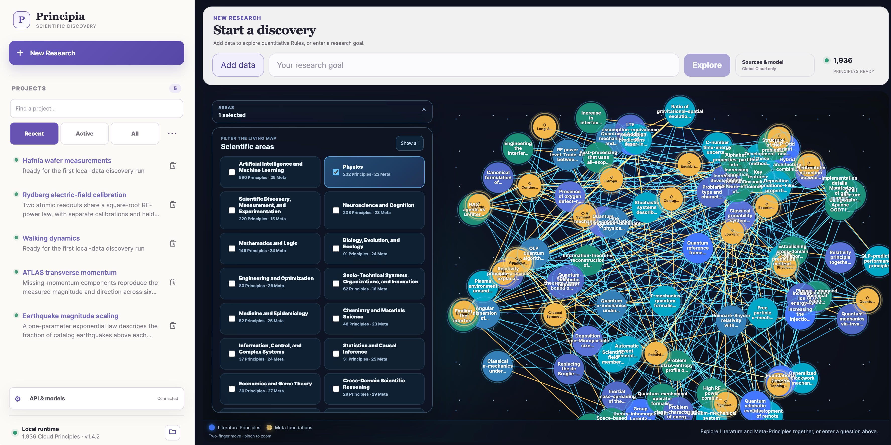
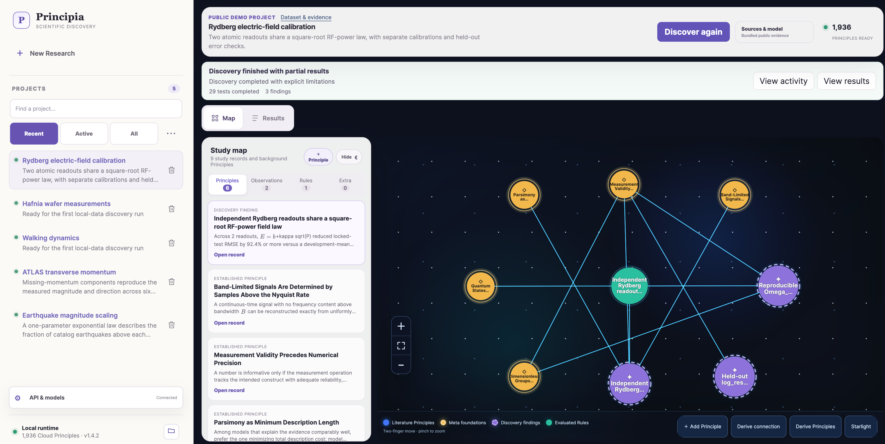
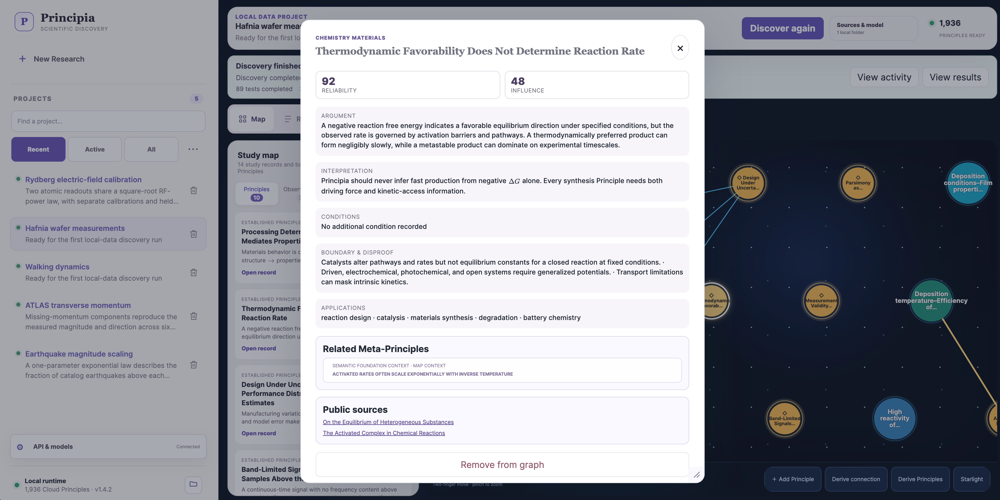
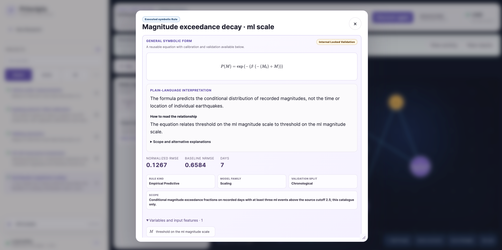
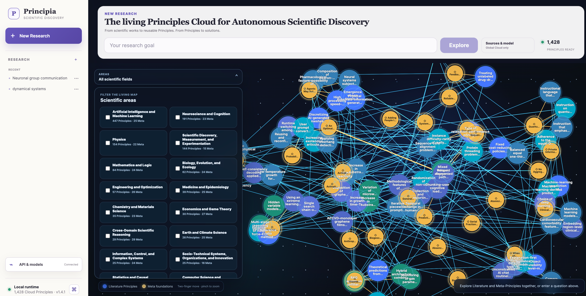
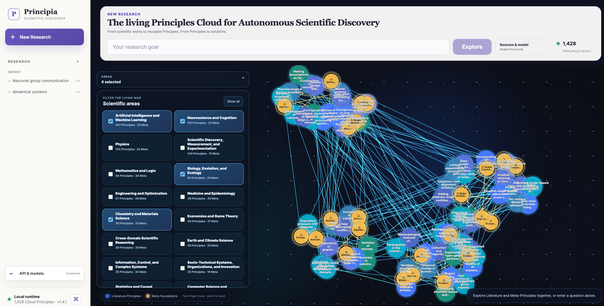
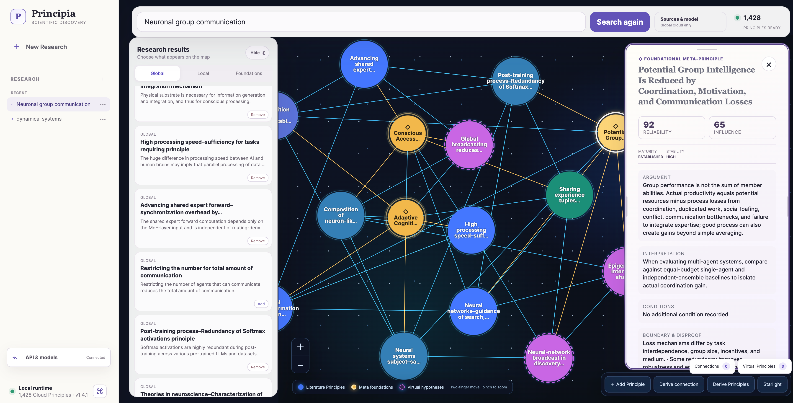

<h1 align="center">Principia</h1>

<p align="center"><strong>Autonomous Scientific Discovery, grounded in Principles and tested against data.</strong></p>
<p align="center">Explore scientific knowledge. Discover interpretable Rules. Inspect the evidence.</p>

<p align="center">
  <a href="./Principia-v1.4.2/"></a>
  <a href="#five-projects-ready-to-explore"></a>
  <a href="./scenario/"></a>
  <a href="./Principia-v1.4.2/core-v1.4.2/LICENSE"></a>
  <a href="https://arxiv.org/abs/2606.29354"></a>
</p>

<p align="center">
  <a href="#start-v142-locally">Quick start</a> ·
  <a href="#five-projects-ready-to-explore">Included projects</a> ·
  <a href="#from-local-data-to-an-inspectable-rule">Discovery workflow</a> ·
  <a href="#twenty-independent-public-test-scenarios">Public scenarios</a> ·
  <a href="#principia-v141">v1.4.1</a> ·
  <a href="#research-foundations">Research</a>
</p>

---

# Principia v1.4.2

**Bring a research goal and a local dataset. Principia connects scientific context with executable analysis to look for compact, interpretable relationships—and keeps the evidence behind each result available for inspection.**

Version 1.4.2 brings dataset-native **Autonomous Scientific Discovery (ASD)** into the Principles workspace. Literature Principles provide scientific context; observations describe computed evidence; extracted Rules carry equations, calibration results, validation decisions, and a stated scope. A study map connects these objects so you can move from a promising relationship to the records that support it.

The release includes **five completed public-data projects**, analyzed with **DeepSeek-V4-Pro**. Their saved maps, results, equations, and packaged evidence open locally without the original datasets or an API key. Connect your own data and models when you are ready to begin a new discovery.

<p align="center">
  <a href="./assets/screenshots-v1.4.2-sep7/main-page.png"></a>
  <br><sub>A shared scientific workspace: explore Principles by area, enter a research goal, or return to a saved project.</sub>
</p>

## From local data to an inspectable Rule

| Stage | What Principia does | What you can inspect |
| :--- | :--- | :--- |
| **Inventory & understand** | Reads supported files, profiles measurements, and connects variables with the research goal and scientific context. | Source inventory, formats, units, coverage, and interpretation. |
| **Generate & evaluate** | Proposes candidate expressions, fits them on development data, and uses validation evidence to compare alternatives. | Executable expressions, fitted parameters, baselines, and candidate tests. |
| **Challenge** | Applies recorded held-out checks and evidence gates before promoting an executable relationship. | Split definitions, errors, controls, failure reasons, and limits of applicability. |
| **Synthesize & explore** | Presents supported Rules alongside observations and relevant Principles in a saved study map. | Typeset equations, plain-language interpretation, linked evidence, and the underlying numerical records. |

**The result is a scientific object you can examine.** A strong fit alone does not establish a mechanism. Known identities, empirical relationships, and tentative interpretations retain their own evidential scope; unsuccessful candidates remain part of the study record. A dataset may produce observations without a Rule that passes the available checks.

<p align="center">
  <a href="./assets/screenshots-v1.4.2-sep7/project-page.png"></a>
  <br><sub>The Rydberg project: move between the study map, discovery results, and individual evidence records.</sub>
</p>

The workspace also supports **Discover again** with a new project by default, configurable reasoning and vision models, visible task activity and stop controls, resizable information panels, and project deletion. Data and workspace state remain separate, so repeated discovery does not require copying the source dataset into each project.

## Five projects ready to explore

These examples span atomic sensing, seismology, particle physics, thin-film metrology, and human movement. Three were selected from the initial twenty-scenario discovery campaign; two were added during subsequent user testing. They illustrate different kinds of useful scientific output, rather than a claim that every recovered relationship is a new law of nature.

| Included project | Relationship to explore | Recorded evidence and scope |
| :--- | :--- | :--- |
| **Rydberg electric-field calibration** | Field amplitude follows a square-root RF-power form: $E_r(P)=b_r+\kappa_r\sqrt{P}$. | Optical and ion readouts have held-out RMSE of **0.0825 and 0.0923 V/m**, over **92% below** their development-mean baselines. Only two held-out power settings per readout; both share the same RF chain. |
| **Earthquake magnitude scaling** | A one-parameter exponential describes conditional magnitude-exceedance fractions: $S(M)=\exp[-\beta(M-2.5)]$. | **18 development, 6 validation, and 7 test days**; test normalized RMSE **0.1267**, versus **0.6584** for the frozen linear baseline. Restricted to the retained `ml` catalog subset; it does not predict event times or locations. |
| **ATLAS transverse momentum** | A parameter-free vector identity: $p_T=\sqrt{p_x^2+p_y^2}$, with a corresponding direction check. | **78,227 events** in two held-out period files; 99th-percentile relative magnitude error about **1.17 × 10⁻⁷**. This checks representation consistency and recovers known geometry. |
| **Hafnia wafer measurements** | A spatial relationship connects measured thin-film thickness with position on a wafer. | Held-out normalized RMSE **0.7471**, **41.1% below** a constant baseline. A fit for the measured specimen; transfer to another wafer remains untested. |
| **Walking dynamics** | Contact moment is reconstructed from normal load and pressure-center displacement. | An executable force-plate consistency relationship under the recorded coordinate convention; it is not evidence of a new biological mechanism. |

Open **Dataset & evidence** for each project's provenance and selection rationale. Open a Rule to inspect its equation, calibration, comparisons, and limitations. Rounded display values are backed by full-precision records. The [demo guide](./Principia-v1.4.2/core-v1.4.2/docs/v1.4.2/demo-projects.md) explains portability, reruns, and deletion.

<table>
  <tr>
    <td width="50%" valign="top">
      <a href="./assets/screenshots-v1.4.2-sep7/principle-page.png"></a>
      <p><strong>Inspect a Principle.</strong><br>Read the scientific statement, its scope, and supporting context without leaving the project.</p>
    </td>
    <td width="50%" valign="top">
      <a href="./assets/screenshots-v1.4.2-sep7/rule-page.png"></a>
      <p><strong>Interrogate a Rule.</strong><br>Follow a typeset equation through interpretation, quantitative checks, and evidence. Click either image for full resolution.</p>
    </td>
  </tr>
</table>

## Start v1.4.2 locally

Use **Python 3.11 or 3.12** in a virtual environment. This is the GitHub source release; the commands below do not depend on a matching version being published to PyPI.

```bash
# Download the application without the separate public test corpus.
git clone --depth 1 --filter=blob:none --sparse https://github.com/pzqpzq/Principia.git
cd Principia
git sparse-checkout set Principia-v1.4.2

python3 -m venv .venv
source .venv/bin/activate
python -m pip install "./Principia-v1.4.2/core-v1.4.2[asd,local]"
principia open --working-directory ./principia-workspace --port 8142
```

On Windows, activate with `.venv\Scripts\Activate.ps1` in PowerShell. The application opens at **http://127.0.0.1:8142/**. Its frontend is already built; Node.js is needed only for frontend development. Dependency installation requires internet access. Once installed, the five demos and their packaged evidence can be browsed offline; external publisher links and remote model calls require a connection.

Demos initialize **once in an empty workspace**. Existing projects are preserved, and deleted demos do not reappear on restart. To try the included projects separately from existing work, choose a new working directory.

### Discover from your own data

1. Choose **New research**, use **Add data** to connect a local folder, and describe your research goal.
2. Open **Sources & model** to configure your provider credentials and select reasoning and vision models. The included examples used **DeepSeek-V4-Pro via SiliconFlow**; new runs use your own configuration.
3. Start discovery and review the provider permission request. **View activity** shows task progress, models, source information, and stop controls.
4. Inspect observations and Rules, follow the evidence, or use **Discover again** to change the goal, data, or models. Keep a new attempt as a separate project or explicitly overwrite the current project.

Raw files remain in the selected folders. Remote analysis can send bounded profiles, excerpts, or previews after per-run permission; it is not a promise of zero network egress. No author credentials or original demo datasets are packaged with the application. A new computation on a demo requires reconnecting the relevant public data. See [ASD](./Principia-v1.4.2/core-v1.4.2/docs/v1.4.2/data-discovery.md), [privacy](./Principia-v1.4.2/core-v1.4.2/docs/v1.4/privacy-and-security.md), and [storage](./Principia-v1.4.2/core-v1.4.2/docs/v1.4.2/storage-policy.md).

## Twenty independent public test scenarios

The separate [`scenario/`](./scenario/) collection covers **twenty independent datasets** and a broad range of scientific formats. Each folder includes source and licensing records, checksums, official data or metadata, a scenario description, and a research brief. These are inputs for exploration and reproducibility; the collection is not a claim of uniform discovery quality across all domains.

| Area | Public scenarios and providers |
| :--- | :--- |
| **Mathematics & astronomy** | [Integer sequences · OEIS](./scenario/01_mathematics_oeis_daily_sequences/) · [Stellar light curves · MAST](./scenario/02_astronomy_mast_tars_sector96/) |
| **Physics** | [Gravitational-wave strain · GWOSC](./scenario/03_physics_gwosc_o4a_h1_strain/) · [Four-lepton events · ATLAS/CERN](./scenario/04_particle_physics_atlas_4lep_2015/) · [Rydberg RF sensing · NIST](./scenario/06_physics_nist_rydberg_rf_sensing/) |
| **Biology & neuroscience** | [Multiomics · GEO](./scenario/05_biology_geo_gse303208_multiomics/) · [Multimodal gait · PhysioNet](./scenario/07_neuroscience_physionet_gait_s1/) · [Neural recordings · DANDI](./scenario/09_neuroscience_dandi_001176/) |
| **Medical imaging** | [Breast MRI · TCIA/IDC](./scenario/08_medical_imaging_tcia_ea1141/) |
| **Computing** | [Vulnerability records · NVD](./scenario/10_computer_security_nvd_recent_snapshot/) · [Inference benchmarks · MLPerf](./scenario/11_ai_mlperf_inference_v6_0/) |
| **Materials & manufacturing** | [Hafnia wafer metrology · NIST](./scenario/12_semiconductor_nist_hafnia_wafer/) · [Encapsulant cure · NIST](./scenario/13_materials_nist_encapsulant_cure/) |
| **Society & economics** | [Household trends · Census HTOPS](./scenario/14_sociology_census_htops_2026/) · [Household finances · Federal Reserve SHED](./scenario/15_economics_federal_reserve_shed_2025/) · [Prices and employment · BLS CPI/CES](./scenario/16_economics_bls_cpi_ces_2026/) |
| **Earth, climate & transport** | [Earthquakes · USGS](./scenario/17_geography_usgs_comcat_2026_07/) · [Storm events · NOAA](./scenario/18_climate_noaa_storm_events_2025/) · [Vehicle safety · NHTSA](./scenario/19_transport_nhtsa_safety_2025_2026/) · [Sea-surface temperature anomalies · NOAA](./scenario/20_ocean_noaa_coral_ssta_20260816/) |

Keep the scenarios separate when comparing discovery runs. Generated research briefs provide context, not measured evidence. Dataset access and reuse follow each publisher's terms, independently of the application's MIT license. **The private TJ scenario is not included.**

To add a single scenario to the sparse checkout above, for example:

```bash
git sparse-checkout add scenario/06_physics_nist_rydberg_rf_sensing
```

## Built for inspection and continued work

The release separates source data, runtime state, and portable demonstration results. Its demo bundle is compressed and checksummed; it carries saved study records, executable Rules, calibrations, and selected derived artifacts without shipping an old runtime database. A clean-release size gate excludes environments, caches, private folders, and credentials. Backend and frontend checks, schema validation, archive hygiene, and a fresh-workspace demo check are included in [v1.4.2 CI](./.github/workflows/principia-v142-ci.yml).

Explore the [source](./Principia-v1.4.2/), read the [demo guide](./Principia-v1.4.2/core-v1.4.2/docs/v1.4.2/demo-projects.md), or browse the [recorded release checks](./Principia-v1.4.2/core-v1.4.2/qa-v1.4.2.json). Computational reproduction requires the original inputs and the recorded analysis conditions; a packaged result remains evidence to assess, not independent replication.

**Help improve Principia.** Share a reproducible issue, a difficult public dataset, or a scientifically meaningful failure case in [GitHub Issues](https://github.com/pzqpzq/Principia/issues). Star or watch the repository to follow development of the Principles Cloud and data-driven scientific discovery.

---

# Principia v1.4.1

Principia v1.4.1 is a local-first research workbench that turns scientific literature into an **inspectable reasoning substrate**. Instead of treating papers as the terminal unit of knowledge, it represents reusable mechanisms, constraints, regularities, trade-offs, boundary conditions, and falsifiers as revisioned **Principles**.

> **Core thesis:** autonomous scientific discovery needs an intermediate scientific language between papers and hypotheses—one that preserves provenance, scope, uncertainty, and falsifiability.

The result is neither a paper database nor a generic chat interface. It is a living map where evidence-linked Principles can be connected to higher-order Meta-Principles, combined into candidate relations, and developed into locally controlled derived Principles.

<p align="center">
  <a href="./assets/screenshots-v1.4.1-aug23/home_page.png">
    
  </a>
</p>

One can select one or several scientific areas, then the Principles Map presents both literature and meta principles from those areas.

<p align="center">
  <a href="./assets/screenshots-v1.4.1-aug23/areas_page.png">
    
  </a>
</p>

## Scientific object model

Principia represents scientific knowledge as a small set of typed, composable objects:

```text
scientific Works
      │  provenance
      ▼
literature Principles  ───── typed relations ─────  literature Principles
      │
      │  foundation assessment
      ▼
Meta-Principles
      │
      │  explicitly selected reasoning context
      ▼
virtual connections and derived Principles
      │
      ▼
validation, revision, or rejection
```

| Object | Scientific contract | Why it matters |
| --- | --- | --- |
| **Work** | A public source identity and bibliographic record. | Keeps every reusable claim connected to where it came from. |
| **Literature Principle** | An evidence-linked claim that retains its argument, scope, conditions, boundaries, falsifier, provenance, relations, and revision history. | Converts papers into scientific units that can be compared, transferred, challenged, and reused. |
| **Meta-Principle** | A higher-order law, constraint, invariant, scaling relation, impossibility result, causal regularity, or design trade-off that can organize claims across domains. | Supplies deeper foundations without erasing domain-specific assumptions. |
| **Derived / virtual artifact** | A candidate connection or Principle produced from an explicitly selected set of literature and Meta-Principles. | Turns retrieval into controlled hypothesis construction rather than unconstrained brainstorming. |

Meta-grounding is deliberately non-authoritative. A Meta-Principle may explain or organize a literature claim, but it cannot rescue unsupported evidence. Conversely, a scientifically sound frontier Principle may remain ungrounded when no compatible foundation is known.

## From retrieval to derivation

| **01 · Discover** | **02 · Inspect** | **03 · Derive** |
| --- | --- | --- |
| Paper-first Global retrieval finds relevant Works, expands them through explicit Work–Principle provenance, and ranks the resulting Principles. Optional Local extraction runs only on folders the user selects. | A scalable WebGL map distinguishes literature Principles, Meta-Principles, and virtual hypotheses. The shared inspector exposes argument, conditions, boundaries, applications, reliability, influence, revisions, relations, and public sources. | **Derive connection** creates removable candidate edges. **Derive Principles** performs multi-level reasoning over up to 20 selected records, balancing novelty with scientific defensibility. |

Global retrieval and selected Local extraction run independently and concurrently. Top-ranked literature Principles and their valid Meta foundations enter the graph first, while the complete Global, Local, and Meta result sets continue to stream into the workspace. Projects preserve graph membership, layout, viewport, results, and virtual artifacts across sessions.

<p align="center">
  <a href="./assets/screenshots-v1.4.1-aug23/projects_page.png">
    
  </a>
</p>

Search results are therefore not the endpoint. They become a bounded and inspectable reasoning context from which researchers can construct, compare, revise, and eventually test new hypotheses. Derived objects remain local, visibly distinct from canonical Cloud records, removable, and under the user's control.

## Why this architecture matters

| Academic research | Industrial R&D |
| --- | --- |
| Principia introduces an explicit intermediate representation between literature retrieval and hypothesis generation. Provenance, cross-domain transfer, foundation alignment, contradiction, revision, and falsification become first-class operations rather than hidden behavior inside a prompt. | The same representation can convert papers, technical reports, and selected private materials into reusable mechanisms, engineering constraints, failure boundaries, and candidate solutions. Local-first storage supports durable R&D memory across projects without treating generated text as institutional truth. |

**The architectural novelty is the combination:** evidence-linked abstraction, Meta-Principle grounding, graph-native exploration, and local hypothesis derivation operate inside one revisioned scientific system. The distinction from conventional document-centric RAG is structural: Principia retrieves and composes scientific objects and relations, not only passages.

## Global Principles Cloud

The Global Principles Cloud is maintained as reviewable canonical JSON under [`global-cloud/`](./global-cloud/). Literature Principles and Meta-Principles are separately sharded but implement one versioned scientific contract and share the derived search and graph indexes.

<p align="center"><strong>v1.4.1 launch snapshot</strong></p>

<table>
  <tr>
    <td align="center"><strong>958</strong><br>Works</td>
    <td align="center"><strong>676</strong><br>Literature Principles</td>
    <td align="center"><strong>405</strong><br>Active Meta-Principles</td>
    <td align="center"><strong>1,081</strong><br>Active Principles</td>
  </tr>
  <tr>
    <td align="center"><strong>2,101</strong><br>Provenance links</td>
    <td align="center"><strong>468</strong><br>Principle relations</td>
    <td align="center"><strong>84</strong><br>Foundation links</td>
    <td align="center"><strong>676</strong><br>Foundation assessments</td>
  </tr>
</table>

The Cloud grows through reviewed, data-only releases; the [latest verified Cloud release](https://github.com/pzqpzq/Principia/releases/latest) provides the live manifest and counts. Canonical updates append revisions rather than erasing history. Public bibliographic metadata and source links remain inspectable, while PDFs, extracted full text, credentials, private URLs, and absolute local paths are forbidden from the Cloud.

GitHub is the distribution layer, not a live database. Deterministic builders publish verified SQLite/vector `.pcg` snapshots and optional `.pcd` deltas through GitHub Releases. Clients validate hashes, schemas, counts, and vector contracts before atomic activation, retain the preceding verified generation for rollback, and degrade visibly to SQLite FTS when semantic vectors are unavailable.

## Local-first by construction

| Boundary | Stored content |
| --- | --- |
| **Shared Cloud cache** | Public, paper-free metadata, Principles, relations, indexes, and verified manifests |
| **Working directory** | Sessions, jobs, provider settings, local Principles, layouts, and virtual artifacts |
| **`local_data/` and connected folders** | User-controlled PDFs, text, notes, and acquired literature |

Connected folders are unselected by default, and private documents are processed only after explicit selection. No local content is uploaded during Global search. Provider credentials are kept through the operating-system credential mechanism and are excluded from frontend state, logs, events, databases, changesets, and artifacts.

## Install and open v1.4.1

v1.4.1 is currently published from source. The stable PyPI release remains v1.3.3 until the v1.4.1 distribution is released separately.

```bash
git clone https://github.com/pzqpzq/Principia.git
cd Principia

python -m venv .venv
source .venv/bin/activate
python -m pip install -e "./Principia-v1.4.1/core[local]"

principia open --working-directory ./principia-workspace
```

Principia opens on a loopback address in the browser. The packaged React application is included in the Python source; Node.js is required only for frontend development.

<details>
<summary><strong>Development and verification</strong></summary>

```bash
cd Principia-v1.4.1/core

python -m pip install -e ".[dev,local]"
python -m pytest -q
python -m ruff check src tests scripts

cd frontend
corepack pnpm install --frozen-lockfile
corepack pnpm test -- --run
corepack pnpm build
```

</details>

### v1.4.1 resources

- [Public v1.4.1 source](./Principia-v1.4.1/core/)
- [Core README](./Principia-v1.4.1/core/README.md)
- [Global Cloud architecture](./Principia-v1.4.1/core/docs/v1.4.1/global-cloud.md)
- [Privacy and security](./Principia-v1.4.1/core/docs/v1.4.1/privacy-security.md)
- [Recovery and deployment](./Principia-v1.4.1/core/docs/v1.4.1/recovery-deployment.md)
- [Canonical Cloud data](./global-cloud/)
- [OpenAPI contract](./Principia-v1.4.1/core/src/principia/openapi-v1.json)
- [Changelog](./Principia-v1.4.1/core/CHANGELOG.md)

---

# Principia v1.3.3 — Evidence-Grounded Idea Discovery

<p align="center"><strong>Ideas from principles. Validated by evidence.</strong></p>

v1.3.3 remains the stable PyPI workflow for turning public literature and optional private research materials into traceable **Idea Cards**, prior-art comparisons, and validation-ready research packs.

```text
research goal
    ↓
public literature + optional private corpus
    ↓
typed scientific feature extraction
    ↓
canonical evidence packet
    ↓
SciDialect-Evo idea generation
    ↓
prior-art comparison
    ↓
deterministic validation plan
```

## What v1.3.3 provides

| Capability | Purpose |
| --- | --- |
| Cross-domain retrieval | Search arXiv, OpenAlex, Crossref, Semantic Scholar, and Europe PMC with identity reconciliation and diagnostics |
| Private research context | Add PDFs, Office files, Markdown, LaTeX, code, and structured text under explicit privacy controls |
| Structured extraction | Convert works into typed ideas, Principles, takeaways, comparators, evaluation contexts, and result facts |
| Canonical evidence | Require every selected citation to resolve to an exact evidence record |
| Strict SciDialect-Evo | Generate three candidates, evolve the strongest two, select one, allow one grounded repair, and fail closed |
| Prior-art comparison | Compare mechanistic similarity, essential differences, potential advantages, and weaknesses |
| Validation hand-off | Derive human-readable and JSON validation plans without another LLM call |
| Controllable jobs | Persist progress, events, checkpoints, pause/resume/stop state, and outputs |

## Install v1.3.3

```bash
python -m pip install principia-ai==1.3.3
```

Optional Office and notebook support:

```bash
python -m pip install "principia-ai[local,notebook]==1.3.3"
```

## One-call workflow

```python
import os
import principia as pc

GOAL = (
    "Develop an evidence-grounded method for improving long-horizon "
    "reasoning efficiency in LLM agents under a fixed token budget."
)

ws = pc.Workspace.project(
    "principia_project",
    llm_config=pc.siliconflow_config(
        os.environ["SILICONFLOW_API_KEY"],
        max_calls=220,
    ),
)

job = ws.start(
    GOAL,
    pipeline_config=pc.PipelineConfig.research(),
)

result = job.result()
result.show()
```

`PipelineConfig.research()` requests 50 public works, constructs an exact 15-record evidence packet, limits per-work concentration, reports retrieval/reranking diagnostics, and runs strict SciDialect-Evo generation.

The result is exported as a seven-file research pack:

```text
idea.md
idea.json
evidence.json
comparison.json
result.json
validation_plan.md
validation_plan.json
```

Generated Idea Cards are hypotheses, not experimentally confirmed discoveries. Canonical evidence improves provenance and recoverability; it does not guarantee that the source or resulting idea is correct.

### v1.3.3 resources

- [Complete v1.3.3 README](./Principia-v1.3/README.md)
- [Examples](./Principia-v1.3/examples/)
- [API reference](./Principia-v1.3/docs/api.md)
- [Private corpus ingestion](./Principia-v1.3/docs/local-corpus.md)
- [Trustworthiness](./Principia-v1.3/docs/trustworthiness.md)
- [Release QA](./Principia-v1.3/RELEASE_QA.md)
- [PyPI release](https://pypi.org/project/principia-ai/1.3.3/)

---

# Research foundations

Principia is shaped by a broader question:

> **What representations should AI agents create, exchange, preserve, and evolve when the objective is scientific discovery rather than fluent conversation?**

## Machine Dialectology and CLSR

[Machine Dialectology](https://github.com/pzqpzq/LSF_MDia) studies how heterogeneous LLM agents can invent, exchange, route, and evolve compact machine-oriented languages. Its ICML 2026 precursor, **When LLMs Develop Languages: Symbolic Communication for Efficient Multi-Agent Reasoning**, introduces Communicative Language Symbolism Routing (CLSR).

- [ICML 2026](https://icml.cc/virtual/2026/poster/61557)
- [OpenReview](https://openreview.net/forum?id=ovpL0ujD6j)
- [arXiv:2606.29354](https://arxiv.org/abs/2606.29354)
- [Code](https://github.com/pzqpzq/LSF_MDia)

Its connection to Principia is representational: mechanisms, constraints, analogies, trade-offs, and falsification rules must become reusable intermediate objects before they can be composed efficiently.

## SciDialect

SciDialect studies **grounded symbolic compression** as an intrinsic reward for scientific discovery agents. Compact states are useful only when task-critical meaning, evidence anchors, and reconstruction remain recoverable.

Principia operationalizes this philosophy through typed scientific objects, explicit evidence references, bounded generation trace, strict validation, and fail-closed persistence.

---

# Repository map

```text
Principia/
  README.md                       # v1.4.1 project overview
  assets/                         # product screenshots
  global-cloud/                   # canonical, paper-free Cloud data and schemas
  Principia-v1.4.1/
    core/                         # regular-user package, API, UI, tests, and docs
  Principia-v1.3/                 # maintained v1.3.3 framework and examples
  legacy/                         # historical releases
```

# Responsible interpretation

Principia is a research framework, not an oracle.

- A fluent claim is not automatically a Principle.
- A reviewed record is not automatically universal outside its stated scope.
- A foundation link is not proof of truth.
- A relation score is not a probability of correctness.
- A virtual Principle is a hypothesis, not a confirmed contribution.
- A generated connection suggests a reasoning path; it does not replace empirical validation.

The intended standard is simple:

> **Every persuasive claim should be paired with an inspectable source, an explicit scope or assumption, and a test that could prove it wrong.**

# Citation

```bibtex
@inproceedings{
pei2026when,
title={When {LLM}s Develop Languages: Symbolic Communication for Efficient Multi-Agent Reasoning},
author={Zhengqi Pei and Qingming Huang and Shuhui Wang},
booktitle={Forty-third International Conference on Machine Learning},
year={2026},
url={https://openreview.net/forum?id=ovpL0ujD6j}
}
```

# License and contact

The repository root is distributed under the [Apache License 2.0](./LICENSE). The v1.4.1 regular-user core is separately released under the [MIT License](./Principia-v1.4.1/core/LICENSE).

**Academic collaboration**  
Institute of Computing Technology, Chinese Academy of Sciences  
`peizhengqi22@mails.ucas.ac.cn`

**Business collaboration**  
Beijing Chipflow Technology Co., Ltd.  
`peizhengqi@chipflow.net`

---

<p align="center"><strong>Let scientific knowledge compound: from works, to Principles, to solutions.</strong></p>

<p align="center">If Principia is useful to your research, consider <a href="https://github.com/pzqpzq/Principia">starring the repository</a> and following the evolution of the Principles Cloud.</p>
