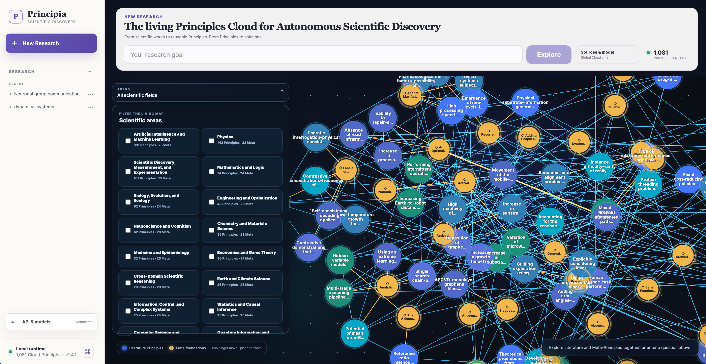
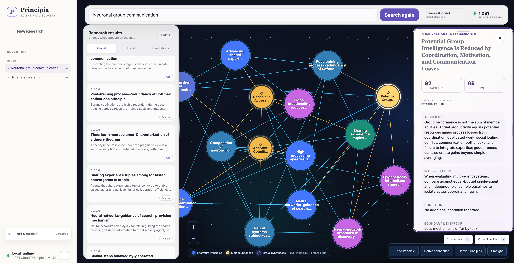

<h1 align="center">Principia</h1>

<p align="center"><strong>The living Principles Cloud for Autonomous Scientific Discovery</strong></p>
<p align="center"><em>From scientific works to reusable Principles. From Principles to solutions.</em></p>

<p align="center">
  <a href="https://github.com/pzqpzq/Principia/actions/workflows/principia-v141-ci.yml"></a>
  <a href="https://github.com/pzqpzq/Principia/tree/main/Principia-v1.4.1/core"></a>
  <a href="https://pypi.org/project/principia-ai/"></a>
  <a href="https://github.com/pzqpzq/Principia/blob/main/Principia-v1.4.1/core/LICENSE"></a>
  <a href="https://icml.cc/virtual/2026/poster/61557"></a>
</p>

<p align="center">
  <a href="#principia-v141">v1.4.1</a> ·
  <a href="#see-the-cloud-think">Living map</a> ·
  <a href="#one-workspace-one-research-flow">Workflow</a> ·
  <a href="#install-and-open-v141">Quick start</a> ·
  <a href="#principia-v133--evidence-grounded-idea-discovery">v1.3.3</a> ·
  <a href="#research-foundations">Research</a>
</p>

---

# Principia v1.4.1

Principia v1.4.1 is a local-first research environment for navigating scientific knowledge as a living system of **Principles** rather than a pile of papers. It searches a versioned Global Principles Cloud, connects literature-derived claims to deeper Meta-Principle foundations, and gives researchers one visual workspace in which to inspect, combine, challenge, and extend scientific ideas.

The central object is not a summary. It is a reusable scientific statement with explicit scope, conditions, boundaries, falsifiers, provenance, relations, and revision history.

<p align="center">
  <a href="./assets/screenshots-v1.4.1-aug23/home.png">
    
  </a>
</p>

## Why Principles?

Scientific literature is optimized for publication, not reuse. The same mechanism may be rediscovered in several fields, hidden behind different vocabularies, or buried inside a long paper. Principia makes the transferable unit explicit:

```text
scientific works
      ↓
evidence-linked literature Principles
      ↓
Meta-Principle foundations and typed relations
      ↓
a searchable, inspectable, evolving knowledge map
      ↓
new hypotheses, connections, and candidate solutions
```

A literature Principle captures what a work supports. A **Meta-Principle** captures a more general law, constraint, reasoning pattern, or foundation that can connect claims across domains. Foundation links are typed and reviewed; a scientifically sound frontier Principle may remain ungrounded when no compatible Meta-Principle exists. Absence of a foundation is never treated as evidence of invalidity.

This representation is designed to make scientific knowledge compound: each new work can strengthen, qualify, contradict, connect, or extend what is already known.

## A Cloud with inspectable structure

The Global Principles Cloud is maintained as reviewable, canonical JSON records under [`global-cloud/`](./global-cloud/). GitHub Releases distribute derived, verified SQLite/vector snapshots for fast local search. Principia downloads and searches those snapshots locally; GitHub is not used as a live database.

v1.4.1 introduced the schema-v2 foundation with the following launch snapshot. The Cloud continues to grow through reviewed, data-only releases; see the [latest verified Cloud release](https://github.com/pzqpzq/Principia/releases/latest) for the live manifest and counts.

| Scientific object | v1.4.1 launch count |
| --- | ---: |
| Works | 958 |
| Literature Principles | 676 |
| Active Meta-Principles | 405 |
| Active Principles in the unified map | 1,081 |
| Work–Principle provenance links | 2,101 |
| Principle relations | 468 |
| Literature–Meta foundation links | 84 |
| Foundation assessments | 676 |

Canonical revisions preserve history. Updating a Principle appends a new revision; retirement does not erase the earlier scientific record. PDFs, extracted full text, credentials, private URLs, and absolute local paths are forbidden from the Cloud. Bibliographic metadata and public source links remain available so that users can inspect where a Principle came from.

## See the Cloud think

The v1.4.1 workspace is built around a scalable WebGL graph rather than a document list. Literature Principles and Meta-Principles have distinct visual identities, while validated edges reveal provenance, scientific relations, and foundation structure.

- Overview zoom presents areas and large-scale structure.
- Mid-range zoom presents GPU-rendered nodes and bounded labels.
- Close zoom reveals readable Principle cards and their local neighborhoods.
- Area filters, semantic search, and viewport loading keep the interaction responsive as the Cloud grows.
- Node positions, viewport, membership, virtual artifacts, and project state save automatically.

The graph is not decorative. Every visible item can be inspected, traced to public sources, added to or removed from a research session, and used as an input to further reasoning.

## One workspace, one research flow

v1.4.1 replaces the old sequence of separate Home, Results, and settings pages with a single **New Research** workspace:

1. Choose a working directory.
2. Enter a research goal.
3. Search the Global Cloud immediately.
4. Optionally select one or more local folders, or find papers online.
5. Let Global retrieval and selected Local extraction run independently and concurrently.
6. Explore Global, Local, and Meta results in one graph and result tray.

Local folders are unselected by default. Principia never spends model calls on private material merely because a folder was connected. Online acquisition remains inside the workspace and downloads selected papers to a goal-named directory under the current working directory's `local_data/` folder.

For each search, the five highest-ranked literature Principles enter the graph first, together with their valid Meta foundations. The complete result set continues to stream into separate Global, Local, and Meta sections. A branch failure does not discard successful results from another branch.

<p align="center">
  <a href="./assets/screenshots-v1.4.1-aug23/project-page.png">
    
  </a>
</p>

Research sessions behave like durable scientific workspaces. They can be renamed, organized into projects, reopened, and deleted. Graph membership and layout persist continuously, so returning to a project restores the researcher’s working context rather than rebuilding an arbitrary visualization.

## Retrieval that follows scientific provenance

Global search is paper-first:

1. Retrieve relevant Works through full-text metadata search and semantic vectors.
2. Fuse the rankings and apply bibliographic filters.
3. Expand matched Works through explicit Work–Principle provenance links.
4. Rank Principles using both matched-paper relevance and direct Principle relevance.
5. Use direct Principle retrieval only when the provenance-grounded cohort underfills the requested result set.

This makes a result explainable: Principia can show not only that a Principle is semantically related, but which relevant papers led to it and how it is connected to the larger foundation.

If the configured embedding service is unavailable, the client degrades visibly to SQLite FTS search rather than silently returning invented semantic confidence.

## Explore, connect, and derive

The workspace supports more than retrieval:

- **Add Global Principles** semantically searches both literature and Meta-Principles and previews records before insertion.
- **Derive virtual connections** reasons over up to 20 selected Principles and creates removable, visibly distinct candidate edges.
- **Derive virtual Principles** uses a chosen model to perform multi-level reasoning over up to 20 selected records, balancing novelty with scientific defensibility.
- Saved virtual Principles remain local, appear in a dedicated collection, and can be added to or removed from the graph without losing the underlying hypothesis.
- A shared record inspector presents argument, interpretation, conditions, boundaries, applications, reliability, influence, foundation relations, revision history, and public sources without duplicating fields.

Virtual objects are hypotheses, not Cloud truth. They are visually distinguished from canonical records and remain under the user’s control.

## Local-first by design

Principia separates three boundaries deliberately:

| Boundary | Stored content |
| --- | --- |
| Global Cloud cache | Public, paper-free metadata, Principles, relations, indexes, and verified manifests |
| Working directory | Sessions, jobs, provider settings, local Principles, layouts, and virtual artifacts |
| `local_data/` and connected folders | User-controlled PDFs, text, notes, and acquired literature |

Private documents are processed only when the user explicitly selects their folder. No local content is uploaded during Global search. Provider credentials are stored through the operating-system credential mechanism and must not enter frontend state, logs, events, databases, changesets, or artifacts.

The shared Cloud cache remains reusable across working directories, while every working directory keeps its private state isolated.

## GitHub-native, database-free distribution

```text
reviewed canonical records on main
              ↓
deterministic release builder
              ↓
verified .pcg snapshot + optional .pcd delta
              ↓
atomic local activation with rollback
              ↓
offline paper-first and semantic search
```

This architecture avoids operating a separate hosted database or vector service. Canonical JSON remains reviewable in Git; derived binaries stay out of ordinary Git history; clients retain the previous verified snapshot for offline use and rollback. Corrupt or truncated assets never replace the active Cloud.

The public v1.4.1 source contains only the regular-user application and neutral read-only Cloud infrastructure. Privileged ingestion, review, credential, and publication tooling is intentionally maintained outside the public source tree and is not included in the frontend bundle or Python distributions.

## Install and open v1.4.1

v1.4.1 is currently published from source. The stable PyPI release remains v1.3.3 until the v1.4.1 distribution is separately released.

```bash
git clone https://github.com/pzqpzq/Principia.git
cd Principia

python -m venv .venv
source .venv/bin/activate
python -m pip install -e "./Principia-v1.4.1/core[local]"

principia open --working-directory ./principia-workspace
```

Principia opens on a loopback address in the browser. The packaged React application is included in the Python source; a Node runtime is needed only for frontend development.

### Development and verification

```bash
cd Principia-v1.4.1/core

python -m pip install -e ".[dev,local]"
python -m pytest -q
python -m ruff check src tests scripts

cd frontend
corepack pnpm install --frozen-lockfile
corepack pnpm test -- --run
corepack pnpm build
```

### v1.4.1 resources

- [Public v1.4.1 source](./Principia-v1.4.1/core/)
- [Core README](./Principia-v1.4.1/core/README.md)
- [Global Cloud architecture](./Principia-v1.4.1/core/docs/v1.4.1/global-cloud.md)
- [Privacy and security](./Principia-v1.4.1/core/docs/v1.4.1/privacy-security.md)
- [Recovery and deployment](./Principia-v1.4.1/core/docs/v1.4.1/recovery-deployment.md)
- [Canonical Cloud data](./global-cloud/)
- [OpenAPI contract](./Principia-v1.4.1/core/src/principia/openapi-v1.json)
- [Changelog](./Principia-v1.4.1/core/CHANGELOG.md)

---

# Principia v1.3.3 — Evidence-Grounded Idea Discovery

<p align="center"><strong>Ideas from principles. Validated by evidence.</strong></p>

v1.3.3 remains the stable PyPI workflow for turning public literature and optional private research materials into traceable **Idea Cards**, prior-art comparisons, and validation-ready research packs.

```text
research goal
    ↓
public literature + optional private corpus
    ↓
typed scientific feature extraction
    ↓
canonical evidence packet
    ↓
SciDialect-Evo idea generation
    ↓
prior-art comparison
    ↓
deterministic validation plan
```

## What v1.3.3 provides

| Capability | Purpose |
| --- | --- |
| Cross-domain retrieval | Search arXiv, OpenAlex, Crossref, Semantic Scholar, and Europe PMC with identity reconciliation and diagnostics |
| Private research context | Add PDFs, Office files, Markdown, LaTeX, code, and structured text under explicit privacy controls |
| Structured extraction | Convert works into typed ideas, Principles, takeaways, comparators, evaluation contexts, and result facts |
| Canonical evidence | Require every selected citation to resolve to an exact evidence record |
| Strict SciDialect-Evo | Generate three candidates, evolve the strongest two, select one, allow one grounded repair, and fail closed |
| Prior-art comparison | Compare mechanistic similarity, essential differences, potential advantages, and weaknesses |
| Validation hand-off | Derive human-readable and JSON validation plans without another LLM call |
| Controllable jobs | Persist progress, events, checkpoints, pause/resume/stop state, and outputs |

## Install v1.3.3

```bash
python -m pip install principia-ai==1.3.3
```

Optional Office and notebook support:

```bash
python -m pip install "principia-ai[local,notebook]==1.3.3"
```

## One-call workflow

```python
import os
import principia as pc

GOAL = (
    "Develop an evidence-grounded method for improving long-horizon "
    "reasoning efficiency in LLM agents under a fixed token budget."
)

ws = pc.Workspace.project(
    "principia_project",
    llm_config=pc.siliconflow_config(
        os.environ["SILICONFLOW_API_KEY"],
        max_calls=220,
    ),
)

job = ws.start(
    GOAL,
    pipeline_config=pc.PipelineConfig.research(),
)

result = job.result()
result.show()
```

`PipelineConfig.research()` requests 50 public works, constructs an exact 15-record evidence packet, limits per-work concentration, reports retrieval/reranking diagnostics, and runs strict SciDialect-Evo generation.

The result is exported as a seven-file research pack:

```text
idea.md
idea.json
evidence.json
comparison.json
result.json
validation_plan.md
validation_plan.json
```

Generated Idea Cards are hypotheses, not experimentally confirmed discoveries. Canonical evidence improves provenance and recoverability; it does not guarantee that the source or resulting idea is correct.

### v1.3.3 resources

- [Complete v1.3.3 README](./Principia-v1.3/README.md)
- [Examples](./Principia-v1.3/examples/)
- [API reference](./Principia-v1.3/docs/api.md)
- [Private corpus ingestion](./Principia-v1.3/docs/local-corpus.md)
- [Trustworthiness](./Principia-v1.3/docs/trustworthiness.md)
- [Release QA](./Principia-v1.3/RELEASE_QA.md)
- [PyPI release](https://pypi.org/project/principia-ai/1.3.3/)

---

# Research foundations

Principia is shaped by a broader question:

> **What representations should AI agents create, exchange, preserve, and evolve when the objective is scientific discovery rather than fluent conversation?**

## Machine Dialectology and CLSR

[Machine Dialectology](https://github.com/pzqpzq/LSF_MDia) studies how heterogeneous LLM agents can invent, exchange, route, and evolve compact machine-oriented languages. Its ICML 2026 precursor, **When LLMs Develop Languages: Symbolic Communication for Efficient Multi-Agent Reasoning**, introduces Communicative Language Symbolism Routing (CLSR).

- [ICML 2026](https://icml.cc/virtual/2026/poster/61557)
- [OpenReview](https://openreview.net/forum?id=ovpL0ujD6j)
- [arXiv:2606.29354](https://arxiv.org/abs/2606.29354)
- [Code](https://github.com/pzqpzq/LSF_MDia)

Its connection to Principia is representational: mechanisms, constraints, analogies, trade-offs, and falsification rules must become reusable intermediate objects before they can be composed efficiently.

## SciDialect

SciDialect studies **grounded symbolic compression** as an intrinsic reward for scientific discovery agents. Compact states are useful only when task-critical meaning, evidence anchors, and reconstruction remain recoverable.

Principia operationalizes this philosophy through typed scientific objects, explicit evidence references, bounded generation trace, strict validation, and fail-closed persistence.

---

# Repository map

```text
Principia/
  README.md                       # v1.4.1 project overview
  assets/                         # product screenshots
  global-cloud/                   # canonical, paper-free Cloud data and schemas
  Principia-v1.4.1/
    core/                         # regular-user package, API, UI, tests, and docs
  Principia-v1.3/                 # maintained v1.3.3 framework and examples
  legacy/                         # historical releases
```

# Responsible interpretation

Principia is a research framework, not an oracle.

- A fluent claim is not automatically a Principle.
- A reviewed record is not automatically universal outside its stated scope.
- A foundation link is not proof of truth.
- A relation score is not a probability of correctness.
- A virtual Principle is a hypothesis, not a confirmed contribution.
- A generated connection suggests a reasoning path; it does not replace empirical validation.

The intended standard is simple:

> **Every persuasive claim should be paired with an inspectable source, an explicit scope or assumption, and a test that could prove it wrong.**

# Citation

```bibtex
@software{principia2026,
  title   = {Principia: The Living Principles Cloud for Autonomous Scientific Discovery},
  author  = {{Principia Contributors}},
  year    = {2026},
  version = {1.4.1},
  url     = {https://github.com/pzqpzq/Principia}
}
```

# License and contact

The repository root is distributed under the [Apache License 2.0](./LICENSE). The v1.4.1 regular-user core is separately released under the [MIT License](./Principia-v1.4.1/core/LICENSE).

**Academic collaboration**  
Institute of Computing Technology, Chinese Academy of Sciences  
`peizhengqi22@mails.ucas.ac.cn`

**Business collaboration**  
Beijing Chipflow Technology Co., Ltd.  
`peizhengqi@chipflow.net`

---

<p align="center"><strong>Let scientific knowledge compound: from works, to Principles, to solutions.</strong></p>

<p align="center">If Principia is useful to your research, consider <a href="https://github.com/pzqpzq/Principia">starring the repository</a> and following the evolution of the Principles Cloud.</p>
